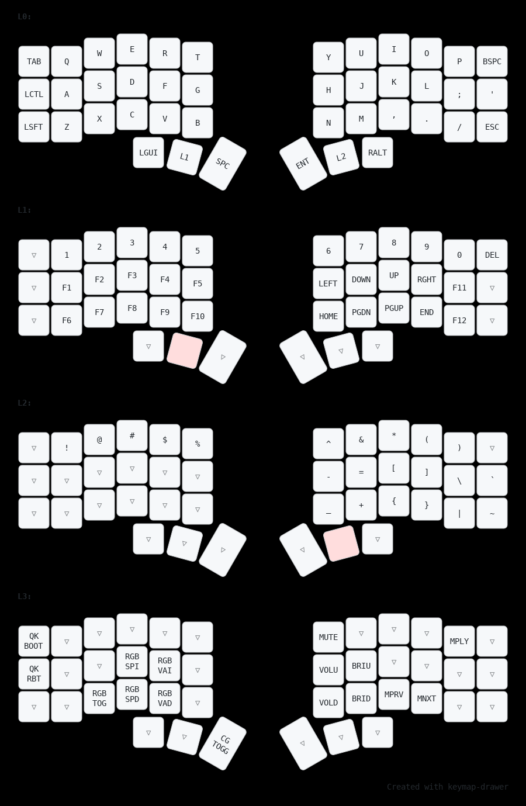

# Boardsource Unicorne

QMK keymap and minor additional customisations for a Boardsource Unicorne split keyboard.

Note that this [QMK External Userspaces](https://docs.qmk.fm/#/newbs_external_userspace).

The keymap diagram was generated by [Keymap Drawer](https://caksoylar.github.io/keymap-drawer?keymap_yaml=H4sIAAAAAAAC_82V227TQBCG7_sUgziYw5TGdpu2RkjYseOEbmzXsdOGUkxoLVE1JMVJJKIQHoO34WV4EtY7A-oVhlKi5MLfbGb2n_nXK3k4mI9nUwsWHz9cZpf5_N14UJxboDAZz4qzfGs2ujgbF6McoawZ8gZh98M0ySZXw4tpZn6qZ-ZyQ-byYmJtAIiaBSeJ7SAcIhwheAgxQoLQR0gR2gghQoTgdKMGgmgkAsFG6CK4CE0EH6GF8BLhQGYRniFo8ifjblOKvEI4RpAbe1IBIUDoyAKU-acIW7JbtxT1U9lG6FK17OEFcqMw5By2SE7LEfVy0E1YSDPfv35DmM6vcgumxWA0WaqMpmtEg2kyt5k7zDpzl7nH3GfWiK4nKjo2dYJBMAnbhB0F4TUTUguPAhWkkULstxIW0Sva_GaAOmGXsEfYZ92aYivseCqIfDfggGfwApdLjRuPsKB_3ufD8-U_iPxtRhiV1-EOv84XzLvEe7S6T6s3tHrANY-JD9Xz0Qr93HZG22RHz5knzFPia1q91dbeSaaeT2jeBbtYMj8zv6zaxx9eemHSNT08ACcMkzU50k6aeP9DNhL9ihJ5DrFz82OIfUd-Htq_4p7drtjRC0WqAidup2t_10tPSehf8-pe8-pWe3V_enX5jcQ9CoLj1V6-hl8a8W9Z-Qe61zV2_wgAAA%3D%3D).

